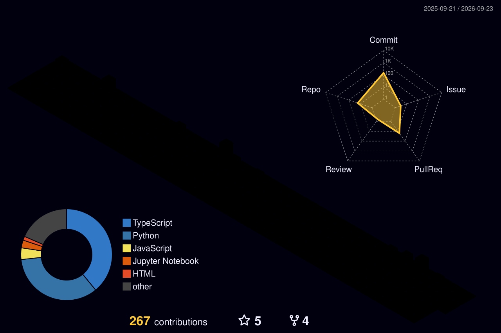

<div align="center">


<a href="https://github.com/Vedag812">
  
</a>

<br/>

[](mailto:vedantagarwal039@gmail.com)&nbsp;
[](https://www.linkedin.com/in/vedant-agarwal-36bb18142/)&nbsp;
[](https://www.kaggle.com/vedantagarwal0812)&nbsp;
[](https://leetcode.com/u/Vedag812/)

<br/>

&nbsp;
&nbsp;


</div>


##  &nbsp;About Me


```yaml
🎓  2nd Year B.Tech CSE
🔬  Focus: Data Science & Machine Learning
🤖  Goal: Aspiring Data Scientist
🌍  Open Source: Contributor to VS Code
📧  vedantagarwal039@gmail.com
```

- 🔭 Building **ML/AI projects** & contributing to open source
- 🌱 Learning **Advanced NLP, Transformers & MLOps**
- 💡 Love exploring **GenAI & intelligent solutions**

<br clear="both"/>


## 🛠️ Technical Skills

<div align="center">

**Languages** &nbsp;•&nbsp; **ML / AI** &nbsp;•&nbsp; **Data Science** &nbsp;•&nbsp; **NLP** &nbsp;•&nbsp; **Tools & Platforms**


</div>


## 🏅 Achievements

<div align="center">

🏛️ **HPAIR Delegate** — Harvard University &nbsp;•&nbsp; 🇮🇳 **Smart India Hackathon** — MoE &nbsp;•&nbsp; ✈️ **British Airways** DS Simulation &nbsp;•&nbsp; 📈 **Deloitte Analytics** Simulation &nbsp;•&nbsp; 🤖 **Google GenAI** Workshop &nbsp;•&nbsp; 🗃️ **SQL Fundamentals** — DataCamp &nbsp;•&nbsp; 💻 **Open Source** — Microsoft VS Code

</div>


##  &nbsp;GitHub Stats

<div align="center">

<a href="https://github.com/Vedag812">
  
</a>&nbsp;&nbsp;
<a href="https://github.com/Vedag812">
  
</a>

</div>

<br/>

<div align="center">
  
</div>

<br/>

<div align="center">
  <picture>
    <source media="(prefers-color-scheme: dark)" srcset="./profile-3d-contrib/profile-night-rainbow.svg" />
    <source media="(prefers-color-scheme: light)" srcset="./profile-3d-contrib/profile-south-season-animate.svg" />
    
  </picture>
</div>


##  &nbsp;LeetCode

<div align="center">
  <a href="https://leetcode.com/u/Vedag812/">
    
  </a>
</div>

<br/>

<div align="center">
  
</div>


